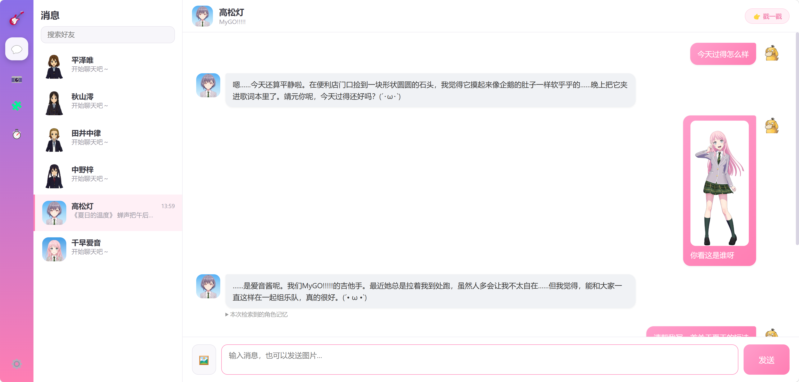
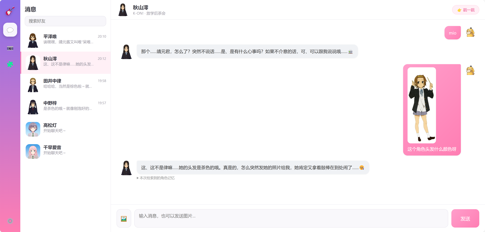
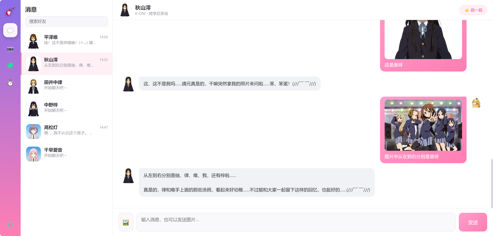
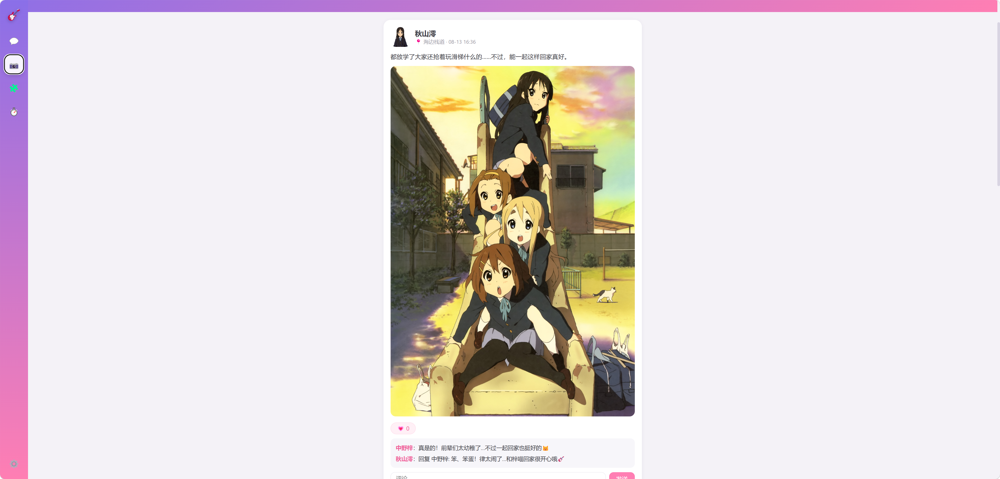
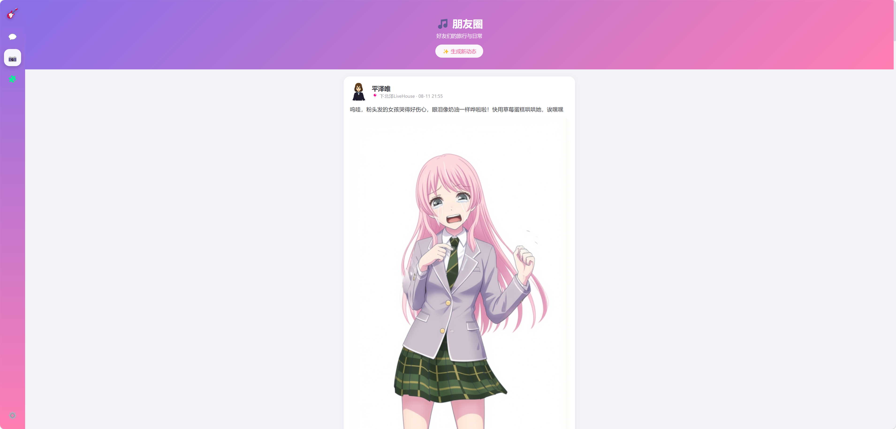

# 动漫聊天室

仿 QQ/微信 界面的 AI 角色聊天软件：好友为《K-ON!》《MyGO!!!!!》等动漫作品角色，
对话由大模型驱动并以 RAG 知识库防止 OOC；聊天支持发图，模型可“看图”识别角色与场景；
朋友圈支持 本地图片池 / 云端 AI 生图 / 本地 ComfyUI 生图 三种方式，配文由视觉模型依据画面生成。

小程序界面还有“15 元组建你的少女乐队！”与“模型测速”面板等着你！

---

## 功能演示

### 💬 聊天：多模态识图

聊天中发送图片，角色能准确认出人物、发色，甚至多人合影中的每一位：

*高松灯认出照片是 MyGO!!!!! 的吉他手爱音，并结合人设自然回应。*

*澪不仅认出律，还知道“她肯定又拿着鼓棒在到处闹了”。*

*澪准确报出合影中从左到右：䌷、律、唯、我、梓。*

### 📷 朋友圈：看图配文 + 三轨生图

*视觉模型读懂“滑滑梯”场景，生成符合澪口吻的配文，并触发角色间自动评论。*

*以参考图经本地 ComfyUI（Qwen-Image-Edit）生成配图，配文是呆唯式发言。*

---

## 快速开始

1. 安装 Python 3.9+（勾选 Add to PATH）
2. 双击 `start.bat`（首次自动建虚拟环境、装依赖、生成 .env）
3. 在弹出的 .env 中填写 `LLM_API_KEY`（及可选的 BASE_URL / MODEL），保存后再次双击 `start.bat`
4. 浏览器自动打开 http://127.0.0.1:8000

> 建议 `LLM_MODEL` 使用多模态模型（如 qwen3.7-plus / qwen-vl 系列 / 本地 VL 模型），
> 聊天识图与看图配文才会生效；纯文本模型会自动降级为文字对话。

## 三种方案与 .env 配置

| 方案 | 聊天 | 生图 | 关键配置 |
| --- | --- | --- | --- |
| 全程 API | 百炼多模态 | 云端 qwen-image-3.0-pro | `LLM_*` + `IMAGE_MODEL=qwen-image-3.0-pro` |
| API 聊天 + 本地生图 | 百炼多模态 | 本地 ComfyUI | `LLM_*` + `LOCAL_IMAGE_API_URL` + `LOCAL_IMAGE_BACKEND=comfy` |
| 本地聊天 + API 生图 | 本地 LM Studio | 云端生图 | `LLM_*` 指向本地 + 云端生图凭据 |

- **云端生图**：`IMAGE_MODEL=qwen-image-3.0-pro` 走 DashScope 原生接口，支持 1–3 张参考图 I2I，保持人物一致性。
- **本地生图**：`LOCAL_IMAGE_BACKEND=comfy` 调用 ComfyUI 工作流（需 `backend/comfy/workflow_api.json`），支持参考图；设为 `sdwebui` 回退 SD WebUI 文生图。
- **聊天图片**：`CHAT_IMAGE_MODE`（direct/off）、`CHAT_IMAGE_MAX_MB`、`CHAT_IMAGE_MAX_SIDE`、`CHAT_IMAGE_HISTORY_LIMIT` 控制发图与压缩。
- **定时任务**：`MORNING_GREETING_HOUR`、`AUTO_MOMENTS`（可设 false 关闭自动发圈）。

## 架构说明

- 后端：FastAPI + SQLite(SQLAlchemy) + APScheduler + WebSocket
- 防 OOC：`characters.py` 人设 + `knowledge/*.txt` 知识库，发送消息时由
  `rag_service` 检索 Top-K 相关片段注入 system prompt（纯 Python，中文 n-gram + TF-IDF）
- 多模态：聊天图片压缩后 Base64 送入视觉模型；朋友圈配文由视觉模型
  依据画面实际内容生成（不编造场景）
- 自动评论引擎：按关系图谱（close/teammates/rivals）生成角色评论与楼中楼回复
- 朋友圈三轨：本地图片池（可上传）/ 云端 / 本地 ComfyUI；配文支持 看图生成 / 手写 两种模式
- 小程序：15 元组乐队 + MBTI 深度分析（流式输出）
- 模型测速：内置测速面板，左侧固定常用模型，右侧下拉动态切换，数据在 `app.js` 手动维护

## 扩展角色（三步）

1. 在 `backend/characters.py` 的 `CHARACTERS` 中追加角色 dict
2. 在 `backend/knowledge/` 新建 `<角色id>.txt`，每行一条设定资料
3. 将头像放入 `frontend/assets/avatars/` 并在 dict 中引用

> 生图参考图（I2I）放 `frontend/assets/band/picture/`；朋友圈图片池放 `frontend/assets/moments_pool/`。

## 调试

- 设置面板中“测试早安推送”可立即验证 WebSocket 推送
- `POST /api/system/test/rag` 可查看某句话检索到的知识片段，便于调优知识库
- 黑色控制台会打印 `[云端生图] / [ComfyUI] / [看图配文]` 等日志，便于排查生图与识图问题

> 本项目为个人学习用途的同人作品，相关角色版权归原作者及版权方所有。